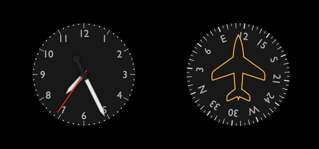

# G3: a flexible framework for steam gauge instrument panels

G3&mdash;a tortured backronym for "generic gauge grammar"&mdash;is a flexible Javascript
framework for designing and running steam gauge style instrument panels
for flight (or other) simulators, to display externally provided metrics.
Here's an example of some of the pre-defined flight instruments
(you can also see a [live demo](https://patricksurry.github.io/)):

<div align='center'>
    
</div>

[G3](https://github.com/patricksurry/g3)
is part of a quixotic pandemic project to build a
[DHC-2 Beaver](https://en.wikipedia.org/wiki/De_Havilland_Canada_DHC-2_Beaver)
cockpit simpit.
Although there are plenty of [alternatives](#resources)
for creating instrument panels,
I decided it would be fun to roll my own based on pure Javascript with SVG using [D3](https://d3js.org/).
After several iterations, I ended up very close to
the pattern suggested by
[Mike Bostock](https://bost.ocks.org/mike/)
several years ago in
[Towards reusable charts](https://bost.ocks.org/mike/chart/).

The base G3 package lets you define gauges and assemble them into control panels.
The G3-examples package also includes a bunch of predefined gauges and a few panels
that you can use or modify as desired.

- [Install G3](#installing)
- [Get started](#getting-started) by running a panel or designing a new gauge
- Give back by [contributing](#contributing) new gauges and panels
- Explore related [resources](#resources)
- Dig in to the full [API reference](#api-reference)

**Keywords**: G3 D3 Javascript SVG flight simulator gauges instruments control panel metrics telemetry

## Installing

TODO

Create a project directory and install G3:

```bash
npm install @patricksurry/g3
```

... or something like that

## Getting started

### Display an existing panel

Check things are working by creating a minimal HTML file that displays an existing panel with fake metrics.
Create a new file called `test.html` containing:

```html
<html>
  <body>
    <!-- TODO - installed vs local package ref -->
    <script src="./g3-examples.min.js"></script>
    <script>
g3.panel('DHC2FlightPanel')('body');
    </script>
  </body>
</html>
```

This tells G3 to retrieve the pre-defined `DHC2FlightPanel` panel,
and draw it as a new SVG object into the HTML `<body>` element.
By default the panel provides fake metrics so you can see your gauges moving
in a somewhat realistic but random way.
Save the file and use a terminal window to serve it locally using your favorite HTTP server.
For example
```shell
python -m http.server
```
or
```shell
npx http-server -p 8000
```
and point your browser at http://localhost:8000/test.html.
You should see something that looks like the [live demo](https://patricksurry.github.io/) above.

### Create a panel with existing gauges

The [examples folder](https://github.com/patricksurry/d3-gauges/tree/master/src/examples)
included with `G3-examples`contains a number of predefined gauges including
[clocks](src/examples/clocks.js),
[flight instruments](src/examples/flight.js),
[engine gauges](src/examples/engine.js),
and [electrical gauges](src/examples/electrical.js);
as well as a few
[example panels](src/examples/panels.js).
You can see them all by modifying `test.html` to display the `DebugPanel` which
automatically displays every registered gauge,
including exploded views of all subgauges.

Let's make a panel that shows a clock and a heading gauge side by side.
Create a new HTML file called `panel.html` that looks like this:
```html
<html>
  <body>
    <script src="./g3-examples.min.js"></script>
    <script>
var panel = g3.panel('SimplePanel')
        .width(600).height(300)
        .append(
            g3.put().x(150).y(150).append(g3.gauge('clockSimple')),
            g3.put().x(450).y(150).append(g3.gauge('headingDHC2')),
        );
panel('body');
    </script>
  </body>
</html>
```
This defines a new panel, `SimplePanel`, which&mdash;when called&mdash;creates a 600x300
SVG container, retrieves existing gauges, and places them at (150,150) and (450,150).
By convention gauges are drawn assuming a radius 100 circle,
but you can simply add `.scale(1.5)` to the `put()` if you prefer radius 150, say.
Serve locally as before and browse to http://localhost:8000/panel.html
and you should see something like this:

<div align='center'>
    
</div>


### Display real metrics

We've built a panel, but it's displaying fake metrics.
G3 can poll an external URL for metrics,
and expects a response containing
a [JSON](https://www.json.org/json-en.html) dictionary
with an entry for each metric.
Unless we specify a polling interval,
it will check four times per second (an interval of 250ms).
 Let's add that to `panel.html`, replacing `panel('body');` with:

```js
...
panel.interval(500).url('/metrics/fake.json')('body');
...
```

Now we just need our server to provide metrics at the endpoint.
First we'll create an endpoint that serves fake metrics:
the behavior will look similar at first but we can hook it up to whatever we want.

TODO - include python fastapi example

TODO - show how we can change a specific metric

More usefully, we'd have our server collect metrics from our simulation,
for example via [SimConnect](https://github.com/odwdinc/Python-SimConnect),
and provide those in our endpoint.

TODO - example of SimConnnect


### Create a new gauge

TODO - simple example

## Contributing

TODO - set up a development environment

Test locally via `src/index.html` and `npm run start`.

Use `rollup` to package, via

```sh
npm run build
```

## Resources

- [Towards reusable charts](https://bost.ocks.org/mike/chart/)
- [Python SimConnect](https://github.com/odwdinc/Python-SimConnect) Python interface for MS FS2020 using SimConnect
- [Sim Innovations](https://siminnovations.com/) create instrument panels with Air Manager
- [Home cockpit simulator control interface](https://hcscis.com/) combine physical instruments and panels
- [MobiFlight](https://www.mobiflight.com) open source project integrating hardware with your flight sim

## API reference

### Key concepts

A [panel](#panel) is a container that presents a collection of [gauges](#gauge),
and orchestrates the display of [metrics](#metrics),
normally retrieved by polling some external source.
(G3 can also generate fake time-varying metrics for development purposes.)
A simple gauge displays some metric,
using a [scale](#scale) to transform the raw metric
and [indicate](#indicate) that value on a local [axis](#axis),
usually adorned with [ticks](#axis), [labels](#axis) and other SVG [decorations](#SVG).
Typical "steam gauges" use a circular coordinate system to indicate
metric values using a rotating [pointer](#indicate).
More complex gauges might display the same metric at several scales
(e.g. a clock with a second, minute and hour hand,
or an altimeter displaying hundreds, thousands and ten-thousands of feet);
contain one or more sub-gauges that display different metrics
(like a combined oil and fuel temperature gauge);
or indicate values using [text](#indicate) (such as a digital watch or radio frequency LCD)
or SVG [style](#indicate) such as color rather than a pointer.
Some gauges *auto-indicate*, in that the gauge itself
tracks the metric value with respect to a fixed point,
for example the pressure reading of an altimeter
or the "day of month" of some watches
where the gauge axis rotates to be visible through a fixed window.

In order to keep things modular, and separate gauge configuration
from usage in a specific panel,
G3 uses the pattern of closures with getter-setter methods
from Mike Bostock's approach to [reusable charts](https://bost.ocks.org/mike/chart/).
This means that most G3 components return a configurable drawing function
which is ultimately rendered to SVG by calling it with a [D3 selection](https://github.com/d3/d3-selection)
or CSS selector string.
The typical drawing function looks like this:
```js
(selection, gauge) => {
  /* append component instance to selection, perhaps based on parent gauge properties */
}
```
[Gauge components](#gauge) use [D3 dispatch](https://github.com/d3/d3-dispatch) to register interest
in the named metric so that the containing [panel](#panel) can send updates as the metric changes.


### Gauge

A [*gauge()*](#g3-gauge) is the core component of G3,
typically containing a number of components to indicate one or more metrics.
Gauges are often decorated with a [*gaugeFace()*](#g3-gaugeFace),
[*gaugeLabel()s*](#g3-gaugeLabel) and [*gaugeScrew()s*](#g3-gaugeScrew).


<a name="g3-gauge" href="#g3-gauge">#</a>
g3.**gauge**(*identifier*: string) · [source](src/gauge.js)

Create a configurable gauge rendering function, registered with the required *identifier*,
or return an existing gauge renderer if the identifier has already been registered.
Use its getter/setter methods (below) to configure it, like *gauge*.r(100),
then call it to draw it within an SVG document like *gauge*(d3.select('svg.mygauge')).
Typically *gauge* is not drawn directly
but instead appended to a [panel](#panel) which will draw it and manage metric updates.
A *gauge* is also [stylable](#stylable) and [appendable](#appendable) via [mixins](#mixins).

*gauge*.**metric**([*metric*: string]) · [source](src/gauge.js)

If *metric* is specified, set the name of the metric that this gauge will indicate.
If *metric* is not specified, return the name of the current metric, defaulting to *undefined*.

*gauge*.**unit**([*unit*: string]) · [source](src/gauge.js)

*(Currently unused.)*
If *unit* is specified, set the unit of measurement for the current metric,
otherwise return the current unit, defaulting to *undefined*.
In future this is intended to support better discovery of metric units and potentially
conversion between compatible units (feet ⟷ meters, inches of mercury ⟷ hectopascals, etc)

*gauge*.**kind**([*kind*: string]) · [source](src/gauge.js)

If *kind* is specified, it must be either the string `circular` or `linear`
to select how the axis is displayed for this gauge.
If *kind* is not specified, return the current value, defaulting to `circular`.

*gauge*.**measure**([*measure*: object]) · [source](src/gauge.js)

If *measure* is specified, it defines a [d3.scale](https://github.com/d3/d3-scale)-like
function which transforms metric values to the axis coordinate system of the gauge,
and provides *measure*.domain() and *measure*.range() accessors reporting the expected
range of the source metric and axis coordinates respectively.
For example, on a gauge with a circular axis,
*gauge*.measure(d3.scaleLinear().domain([0,10]).range([-90, 90]))
would map a metric expected to take values between 0 and 10 to a semi-circular axis on the top half of the gauge face.

*gauge*.**r**([*radius*: number]) · [source](src/gauge.js)

If *radius* is specified it defines the size of the gauge in SVG units,
otherwise the current *radius* is returned, defaulting to 100.
For circular gauges, the axis line will be placed here.

<a name="g3-gauge-autoindicate"></a>
*gauge*.**autoindicate**([*flag*: bool]) · [source](src/gauge.js)

If *flag* is set, the boolean value defines whether this gauge should self-indicate,
otherwise return the current value, defaulting to false.
Most gauges are fixed and use a pointer, text or style to indicate the current metric value.
A self-indicating gauge transforms itself so that the axis location corresponding
to the current metric value stays at a fixed position.
A circular gauge rotates so the correct axis value is shown at the top,
and a linear gauge slides itself to the correct axis value is shown centered at *x*=0.

*gauge*.**clip**([*clippath*: function]) · [source](src/gauge.js)

If *clippath* is set, it defines a G3 drawing function that, when called, draws a clipping path for this gauge.
Otherwise, it returns the current drawing function, defaulting to undefined.
For complex nested gauges, like the attitude indicator, it is sometimes convenient to clip to a simple circle
via *gauge*.clip(g3.gaugeFace()).


<a name="g3-gaugeFace" href="#g3-gaugeFace">#</a>
g3.**gaugeFace**() · [source](src/gauge.js)

Returns a [stylable](#stylable) *gaugeFace* object, which when called will draw a circle with CSS class `g3-gauge-face`.

*gaugeFace*.**r**([*r*: number]) · [source](src/gauge.js)

If *r* is defined, set the radius for the circular face, otherwise return the current value, defaulting to 100.

*gaugeFace*.**window**([*window*: object]) · [source](src/gauge.js)

If *window* is defined, use that drawing function to define an
[SVG mask](https://developer.mozilla.org/en-US/docs/Web/SVG/Element/mask)
on the gauge face to "cut out" a window.  Otherwise, return the current window defaulting to undefined.


<a name="g3-gaugeLabel" href="#g3-gaugeLabel">#</a>
g3.**gaugeLabel**([*value*: string[, *opts*: object]]) · [source](src/gauge.js)

Create a [stylable](#stylable) *gaugeLabel* function is called to add SVG text to a gauge.
If *value* is set, it defines the initial value of the label.
The optional *opts* can be used as a shortcut for the accessor functions.
For example `g3.gaugeLabel("hello", {x: 20, y: 20})`
is equivalent to `g3.gaugeLabel().value("hello").x(20).y(20)`.

*gaugeLabel*.**value**([*value*: string]) · [source](src/gauge.js)

Set the label text to *value* if defined, otherwise return the current value.

*gaugeLabel*.**x**([*x*: number]) · [source](src/gauge.js)

*gaugeLabel*.**y**([*y*: number]) · [source](src/gauge.js)

*gaugeLabel*.**dx**([*dx*: number]) · [source](src/gauge.js)

*gaugeLabel*.**dy**([*dy*: number]) · [source](src/gauge.js)

Set or return the *x*, *y*, *dx* or *dy* values of the underlying
[SVG text element](https://developer.mozilla.org/en-US/docs/Web/SVG/Element/text)
respectively.


<a name="g3-gaugeScrew" href="#g3-gaugeScrew">#</a>
g3.**gaugeScrew**() · [source](src/gauge.js)

A *gaugeScrew* configures a [stylable](#stylable), [transformable](#transformable) screw head.
When called, draws the screw with the selected head shape oriented in a random rotation.

*gaugeScrew*.**r**([*r*: number]) · [source](src/gauge.js)

If *r* is defined, set the radius of the screw head, otherwise return the current value, defaulting to 8.

*gaugeScrew*.**shape**([*shape*: string]) · [source](src/gauge.js)

If *shape* is defined, sets the screw head style to one of `slotted`, `phillips` or `robertson`.
Otherwise returns the current shape, defaulting to `slotted`.


### Axis

The gauge axis represents the metric on the gauge face,
with the gauge measure mapping from the metric domain
to the range of coordinates of the gauge itself.
An [*axisLine()*](#g3-axisLine) draws a line covering the domain of the metric,
usually including [*axisTicks()*](#g3-axisTicks) to draw tick marks,
and [*axisLabels()*](#g3-axisLabels) to add labels.
Sometimes [*axisSector()s*] are used to highlight particular regions of the axis,
and can also be used for windows, rings or other annular decorations.


<a name="g3-axisLine" href="#g3-axisLine">#</a>
g3.**axisLine**() · [source](src/axis.js)

Returns a [stylable](#stylable) *axisLine*, which draws a line spanning the domain of its parent gauge's metric.
Essentially a shortcut for g3.axisSector([*min, max*]).size(0).inset(0).class('g3-axis-line')
where [*min, max*] are the smallest and largest values of this gauge's metric.


<a name="g3-axisTicks" href="#g3-axisTicks">#</a>
g3.**axisTicks**([*vs*: array<number>]) · [source](src/axis.js)

Returns a [stylable](#stylable) *axisTicks* object, which will draw tick marks along the axis line.
The optional *vs* defines a list of specific tick mark locations in the metric domain.

*axisTicks*.**values**([*vs*: array<number>]) · [source](src/axis.js)

If *vs* is defined, set specific tick mark locations along the axis, in the metric domain.
Otherwise return the current list of locations, which defaults to none.
See also *axisTicks*.start() and  *axisTicks*.step()

*axisTicks*.**step**([*step*: number]) · [source](src/axis.js)

If *step* is defined, set the step size for tick marks in the metric domain.
Otherwise return the current value, which defaults to 1.
See also  *axisTicks*.start().

*axisTicks*.**start**([*start*: number]) · [source](src/axis.js)

If *start* is defined, set the first tick mark location in the metric domain.
Otherwise return the current value, which defaults to *gauge*.metric().domain()[0].

*axisTicks*.**shape**([*shape*: string]) · [source](src/axis.js)

If *shape* is defined, sets the current tick mark shape to one of `tick`, `dot`, `wedge` or `rect`.
Otherwise, return the current shape, which defaults to `tick`.

*axisTicks*.**size**([*size*: number]) · [source](src/axis.js)

If *size* is defined, set the current tick mark size, otherwise return the current value,
which defaults to 10.
The *size* is measured inward from the axis line,
use a negative value (or negative inset) for outward ticks
on a circular gauge.

*axisTicks*.**width**([*width*: number]) · [source](src/axis.js)

If *width* is defined, set the current tick mark width along the axis, in SVG units.
Otherwise return the current value, which defaults to 1.
The `wedge` and `rect` shapes support *width*.

*axisTicks*.**inset**([*inset*: number]) · [source](src/axis.js)

If *inset* is defined, set the current tick mark inset inside the axis line.
Otherwise, return the default value, which defaults to 0.


<a name="g3-axisLabels" href="#g3-axisLabels">#</a>
g3.**axisLabels**([*vs*: array<number>]) · [source](src/axis.js)

Returns a [stylable](#stylable) *axisLabels* object,
which will draw text labels relative to the gauge's metric domain.
The optional *vs* defines a list of specific label locations in the metric domain.

*axisLabels*.**values**([*vs*: array<number>|object]) · [source](src/axis.js)

If *vs* is defined, set specific label locations along the axis, in the metric domain.
If *vs* is an array of numbers, each value defines a label position
with a text label produced by *axisLabels*.format().
If *vs* is an object, each key is interpreted as a number with the
value giving the text label.
For example
*axisLabels*.values([0, 5, 10]) or
*axisLabels*.values({0: "empty", 10: "full"}).
Otherwise return the current list of label locations, which defaults to none.
See also *axisLabels*.start() and  *axisLabels*.step()

*axisLabels*.**step**([*step*: number]) · [source](src/axis.js)

If *step* is defined, set the step size for labels in the metric domain.
Otherwise return the current value, which defaults to 1.
See also  *axisLabels*.start().

*axisLabels*.**start**([*start*: number]) · [source](src/axis.js)

If *start* is defined, set the first label location in the metric domain.
Otherwise return the current value, which defaults to *gauge*.metric().domain()[0].

*axisLabels*.**format**([*format*: number => string]) · [source](src/axis.js)

If *format* is defined, it is assumed to be a function that converts a
metric value indicating a label position to the appropriate text label.
For example *axisLabels*.format(v => Math.round(v/100)) might be used
to label a gauge in hundreds.

*axisLabels*.**size**([*size*: number]) · [source](src/axis.js)

If *size* is defined, set the text size in SVG units.
Otherwise return the current size, which defaults to 20.

*axisLabels*.**inset**([*inset*: number]) · [source](src/axis.js)

If *inset* is defined, set the current tick mark inset inside the axis line.
Otherwise, return the default value, which defaults to 0.

*axisLabels*.**orient**([*orient*: string]) · [source](src/axis.js)

If *orient* is defined, it indicates one of the label orientations
`fixed`, `relative`, `cw`, `ccw`.
Otherwise it returns the current orientation which defaults to `fixed`.
In `fixed` orientation, labels ignore the local direction of the axis,
i.e. on a circular gauge with all labels would appear as unrotated text.
In `relative` orientation, labels are tangent
to the axis at their position,
i.e. on a circular gauge all labels would read along the circle.
Note that *axisLabels*.rotate() applies
subsequent to this basic orientation.
In `cw` or `ccw` orientation, text is laid out along the axis path
centered on the label location, so that on a circular gauge
labels wrap around the circle,
reading either clockwise (`cw`) or counterclockwise (`ccw`).
Additional rotation does not apply in this case.

TODO: support a 'sticky' orientation which is like relative
but chooses between the actual rotation and an additional half turn
based on which is more 'upright'.

*axisLabels*.**rotate**([*rotate*: number]) · [source](src/axis.js)

If *rotate* is defined, set the current rotation angle in degrees.
Otherwise return the current rotation, which defaults to 0.
See also *orient* and *upright*.


<a name="g3-axisSector" href="#g3-axisSector">#</a>
g3.**axisSector**(*vs*: array<number>) · [source](src/axis.js)

Returns a [stylable](#stylable) *axisSector* object, which draws part of an
[annulus](https://en.wikipedia.org/wiki/Annulus_(mathematics)) relative to the gauge's axis line.
This is typically used to highlight important regions of the axis,
and can also be used to add windows, rings or other annular decorations.

*axisSector*.**size**([*size*: number]) · [source](src/axis.js)

If *size* is defined, sets the width of the sector in SVG units, otherwise returning the current value,
which defaults to 5.  Size is measured inward from the axis line.

*axisSector*.**inset**([*inset*: number]) · [source](src/axis.js)

If *inset* is defined, sets the distance inside the axis line the outer rim of the sector.
Otherwise returns the current value, which defaults to 0.
Use a negative value for sectors outside the axis line.


### Indicate

Gauges are only useful when they *indicate* one or more metrics.
Some gauges [self indicate][#g3-gauge-autoindicate] but most
use a [pointer](#g3-indicatePointer), [text](#g3-indicateText),
or [style](#g3-indicateStyle) to display the current metric value.


<a name="g3-indicateText" href="#g3-indicateText">#</a>
g3.**indicateText**() · [source](src/indicate.js)

Returns a [stylable](#stylable) *indicateText* object,
which is called to update the current metric value as text,
with optional formatting.
Use [g3-put()](#g3-put) to control the positioning of the text.


*indicateText*.**format**([*format*: any => string]) · [source](src/indicate.js)

If *format* is defined, it specifies a function that converts metric values to text.
Otherwise returns the current formatter, which defaults to the identity function.
For example, *indicateText*.format(v => Math.round(v/100)) would display the
metric value in hundreds.

*indicateText*.**size**([*size*: number]) · [source](src/indicate.js)

If *size* is defined, specifies the size of the text in SVG units,
otherwise returns the current size, defaulting to 20.


<a name="g3-indicatePointer" href="#g3-indicatePointer">#</a>
g3.**indicatePointer**() · [source](src/indicate.js)

Returns a [stylable](#stylable), [appendable](#appendable) *indicatePointer* object,
which is called to draw a pointer that typically points to the current metric value,
or a rescaled version, on the gauge axis.

*indicatePointer*.**shape**([*shape*: string]) · [source](src/indicate.js)

If *shape* is defined, selects a pointer shape from the enumeration in [pointers.js](src/pointers.js).
The shapes currently available are illustrated below.
Otherwise, returns the current pointer shape, defaulting to `needle`.

<div align='center'>
    
</div>

*indicatePointer*.**rescale**([*rescale*: any => any]) · [source](src/indicate.js)

If *rescale* is defined, specifies a function to rescale the current metric value before
indicating.
Otherwise, returns the current transformation, which defaults to the identity function.
For example, an altimeter might indicate in hundreds, thousands and ten-thousands
using pointers with different scalings.


<a name="g3-indicateStyle" href="#g3-indicateStyle">#</a>
g3.**indicateStyle**() · [source](src/indicate.js)

Returns an [appendable](#appendable) *indicateStyle* object,
which is called to apply CSS styling conditional on the current metric.
A trigger function chooses between "on" or "off" styling.
The default style shows or hides the *indicateStyle* contents
depending on whether the metric is non-zero.
See also [statusLight](#g3-statusLight) which provides
a convenience wrapper for indicator lights.

*indicateStyle*.**trigger**([*trigger*: any => boolean]) · [source](src/indicate.js)

If *trigger* is defined, specifies a function that decides whether
the style should be on or off based on the current metric value.
Otherwise, returns the current trigger function, which defaults to the identity
(meaning that the style is on whenever the metric is non-zero).

*indicateStyle*.**styleOn**([*styleOn*: object]) · [source](src/indicate.js)

If *styleOn* is defined, it specifies a dictionary of styles to apply
to the *indicateStyle* contents when the *trigger* is true.
Otherwise, returns the current styles, which default to `{opacity: 1}`.

*indicateStyle*.**styleOff**([*styleOff*: object]) · [source](src/indicate.js)

If *styleOff* is defined, it specifies a dictionary of styles to apply
to the *indicateStyle* contents when the *trigger* is false.
Otherwise, returns the current styles, which default to `{opacity: 0}`.


<a name="g3-statusLight" href="#g3-statusLight">#</a>
g3.**statusLight**() · [source](src/gauge.js)

TODO: actually a gauge

### Panel

TODO

[source](src/panel.js)

### Mixins

Many G3 object support standard configuration options via mixins.

<a name="stylable" href="#stylable">#</a>
**stylable** objects support CSS styling,
by adding class names, element styles, or inline CSS using the
[@emotion/css package](https://www.npmjs.com/package/@emotion/css).

*stylable*.**style**([*style*: string]) · [source](src/mixin.js)

If *style* is defined, set the object's inline style property, otherwise return the current inline style value.

*stylable*.**class**([*class*: string]) · [source](src/mixin.js)

If *class* is defined, add it as a space-separated list of class names to the object's class property,
otherwise return the current space-separated list of classes.

*stylable*.**css**([*css*: string]) · [source](src/mixin.js)

If *css* is defined, interpret as inline CSS rules using [@emotion/css](https://www.npmjs.com/package/@emotion/css),
which injects the CSS into the HTML doc using a new class name and adds that class to the current list of classes.
If *css* is not defined, return the current space-separated list of classes.
This can be helpful to override the default style of child elements that are not directly stylable themselves.

<a name="transformable" href="#transformable">#</a>
**transformable** objects support
[SVG transformation](https://developer.mozilla.org/en-US/docs/Web/SVG/Attribute/transform)
via translation, scaling and rotation.
Note the resulting transformation is always applied as `translate(...) scale(...) rotate(...)`
regardless of the order in which the transformation is configured.
Also note that applies transformations right to left, so rotation happens first,
then scaling, and finally translation.

*transformable*.**x**([*x*: number]) · [source](src/mixin.js)

*transformable*.**y**([*y*: number]) · [source](src/mixin.js)

If *x* (*y*) is defined, set the current translation in the x (y) direction,
otherwise return the current value, which defaults to 0.

*transformable*.**scale**([*sx*: number, [*sy*: number]]) · [source](src/mixin.js)

If both *sx* and *sy* are defined, set the corresponding scale in each dimension.
If only one value *sx* is provided, set a common scale in both dimensions.
If no arguments are provided, return an array with the current [*sx, sy*] values,
which default to [1, 1].

*transformable*.**rotate**([*angle*: number]) · [source](src/mixin.js)

If *angle* is defined, set the current rotation, otherwise return the current value, which defaults to 0.

<a name="appendable" href="#appendable">#</a>
**appendable** objects support appending of child objects,
as well as shared global definitions like fill patterns, gradients or SVG filters.
This allows flexible nested configuration of panels and gauges.

*appendable*.**append**([*a*, [*b*, [*c*, ...]]]: object) · [source](src/mixin.js)

If any arguments are provided, append those G3 objects to *appendable*,
otherwise return the current list of appended objects, defaulting to the empty list.
The Javascript spread operator `...` is useful to append from a list,
e.g. *appendable*.append(...*xs*).

*appendable*.**defs**([*a*, [*b*, [*c*, ...]]]: object) · [source](src/mixin.js)

Similar to *appendable*.**append**() but when this object is drawn the appended *defs*
are added to a [`<defs>`](https://developer.mozilla.org/en-US/docs/Web/SVG/Element/defs)
child of the top-level `<svg>` container.
These elements aren't rendered directly but referenced from other parts of the SVG.


### SVG elements

TODO

[source](src/common.js)

g3.element()

styable, appendable

attr

g3.put()

stylable, transformable, appendable container

g3.snapScale()

Returns a function that  continuous snap
useful for rescale
start, step, strength

## TODO

- indicateSector

- indicateOdometer

- cylindrical axis stye for a magnetic compass, where we're looking at a disc edge on
can we do a circle scale(1,0) ?

- more throw messages. e.g. for g.measure(2) should be g.measure()(2) type of 2 isn't function

- re-usability is not great, e.g. draw & modify different versions of a gauge, or reuse tick labeling components

- upright axis label style

- custom tick mark shape option for VSI arrows

- fix drop-shadow for window cutout in altitudeDHC2 - apply to mask?

- more pointer shapes, standardize names https://upload.wikimedia.org/wikipedia/commons/b/bc/Watch_hands_styles_fr.svg

- Omega tachymeter example

- diff on prior metrics + warn on missing metric after first call?

