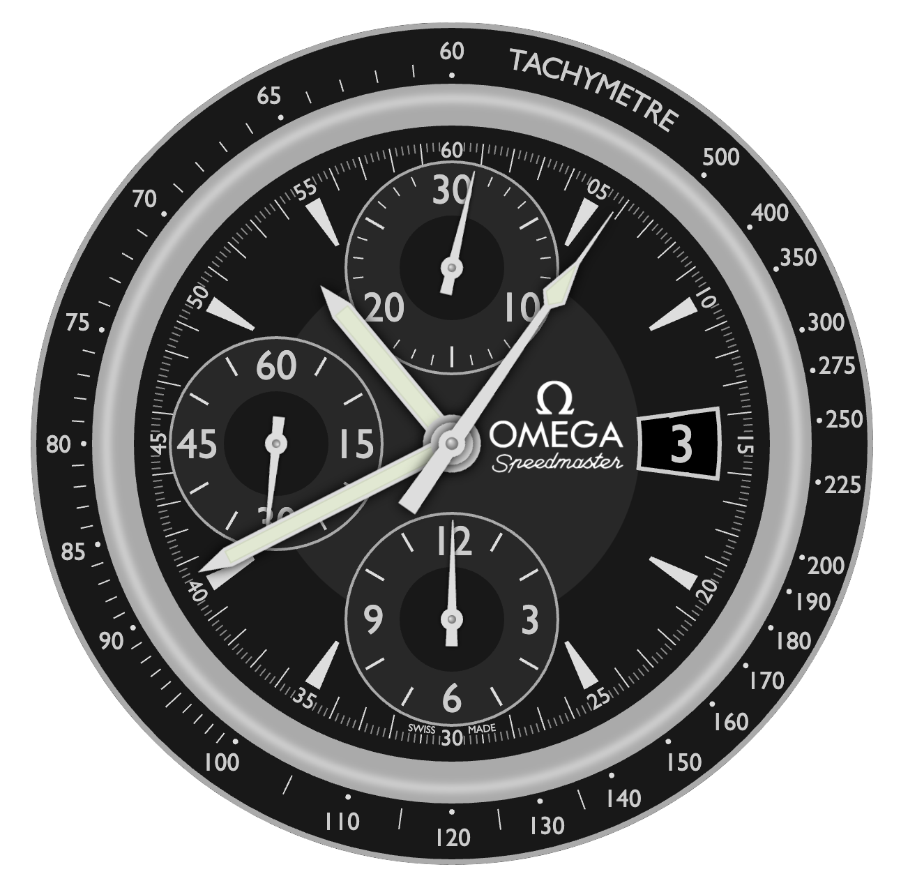
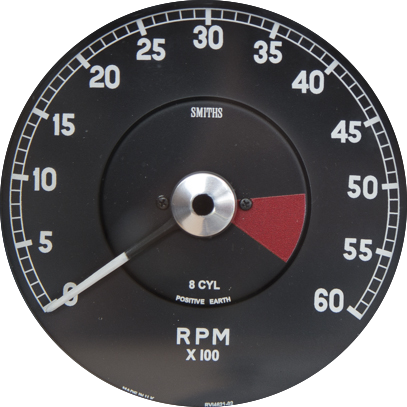
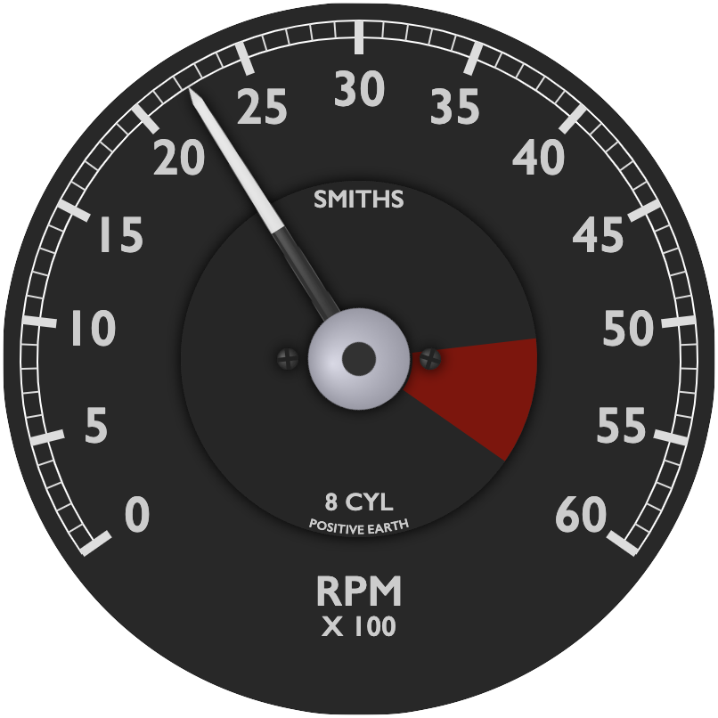
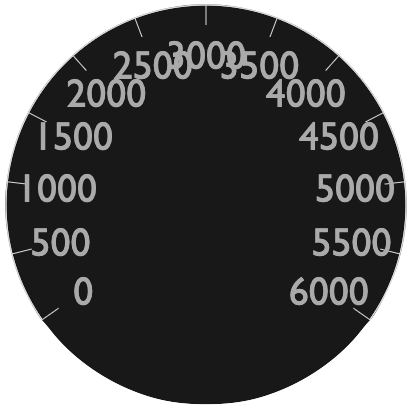
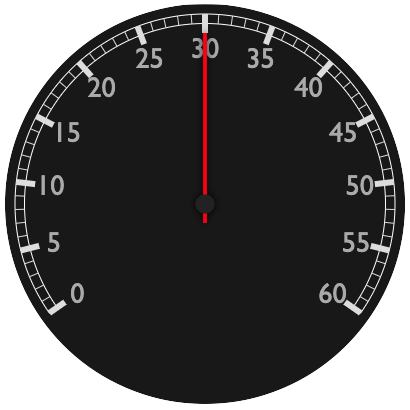

# G3: a flexible framework for steam gauge instrument panels

[G3](https://github.com/patricksurry/g3) is a flexible Javascript
framework for building steam gauge instrument panels
that display live external metrics from flight (or other) simulators
like [X-Plane](https://www.x-plane.com/) and [Microsoft FS2020](https://www.flightsimulator.com/).
Here's a screenshot with some of the included flight gauges
(or try this [live demo](https://patricksurry.github.io/)):

<div align='center'>
    
</div>

### TL;DR

- [Install G3](#installing)
- [Get started](#getting-started) by running a panel or designing a new gauge
- Browse the complete [API reference](#api-reference)
- Give back by [contributing](#contributing) new gauges and panels
- Explore related [resources](#resources)

**Keywords**: G3 D3 Javascript SVG flight simulator gauges instruments
control panel metrics telemetry dashboard visualization dataviz
XPlane FS2020

G3's goal is to provide a lightweight, browser-based solution
for building steam-gauge control panels using simple hardware atop a
commodity LCD display, powered by an affordable single-board computer
like the [Pi](https://www.raspberrypi.org/).
One of my original inspirations was this
[awesome Cessna setup](https://cessna172sim.allanglen.com/docs/instrument-panel/).
G3 could also be useful for interactive data visualizations and dashboards.

The name G3 is a tortured backronym for "generic gauge grammar"&mdash;and
has an [aircraft connection](https://en.wikipedia.org/wiki/Gulfstream_III)&mdash;but
was mainly chosen in homage to [D3](https://d3js.org/).
It's part of a quixotic pandemic project to build a
[DHC-2 Beaver](https://en.wikipedia.org/wiki/De_Havilland_Canada_DHC-2_Beaver) simpit.
Although there are plenty of [alternatives](#resources)
for creating instrument panels,
I decided it would be fun to roll my own based on pure Javascript with SVG using D3.
After several iterations, I ended up very close to
the pattern suggested by
[Mike Bostock](https://bost.ocks.org/mike/)
several years ago in
[Towards reusable charts](https://bost.ocks.org/mike/chart/).

The iconic [Omega Speedmaster](https://en.wikipedia.org/wiki/Omega_Speedmaster) watch,
mimicked by the example `omegaSpeedmaster` gauge below
(see [live demo](https://bl.ocks.org/patricksurry/95f8f76a1dfd3c84e7a31429c7cbddc9)),
showcases G3's flexibility to create complex, working gauges that look good:

<div align='center'>
    
</div>


## Installing

You can skip installing altogether and just refer to a standalone copy of the
module distribution from an NPM CDN like these:

    https://unpkg.com/@patricksurry/g3/dist/g3-examples.min.js

    https://cdn.jsdelivr.net/npm/@patricksurry/g3/dist/g3-examples.min.js

You can also set up an [npm project](https://docs.npmjs.com/getting-started),
by creating a project directory and installing G3:

    npm install @patricksurry/g3

If you prefer, you can download a
[bundled distribution from github](https://github.com/patricksurry/g3/tree/master/dist),
by picking any of `g3[-examples][.min].js`,
clicking the 'Raw' button, and then right-clicking to "save as".
The base `g3` package provides the API to define gauges and assemble them into control panels,
and the `g3-examples` package adds a bunch of predefined gauges and panels
that you can use or modify.   The `.min` versions are minified to load slightly faster,
but harder to debug.  Choosing `g3-examples.js` is probably a good start.
See [Contributing](#contributing) if you want to hack on G3.

## Getting started

### Display an existing panel

Check things are working by creating a minimal HTML file that displays an existing panel with fake metrics.
Create a new file called `test.html` that looks like this:

```html
<html>
  <body>
    <script src="https://unpkg.com/@patricksurry/g3/dist/g3-examples.min.js"></script>
    <script>
g3.panel('DHC2FlightPanel')('body');
    </script>
  </body>
</html>
```

This tells G3 to fetch the pre-defined `DHC2FlightPanel` example panel,
and draw it as a new SVG object appended to the HTML `<body>` element.
By default the panel provides fake metrics so you can see your gauges moving
in a somewhat realistic but random way.
Save the file and use a terminal window to serve it locally using your favorite HTTP server.
For example try:
```shell
python -m http.server
```
or
```shell
npx http-server -p 8000
```
and then point your browser at http://localhost:8000/test.html.
You should see something that looks like the [live demo](https://patricksurry.github.io/)
above.

### Create a panel with existing gauges

The [examples folder](src/examples)
included with `g3-examples.js` contains a number of predefined gauges including
[clocks](src/examples/clocks.js),
[flight instruments](src/examples/flight.js),
[engine gauges](src/examples/engine.js),
and [electrical gauges](src/examples/electrical.js);
as well as a few
[example panels](src/examples/panels.js).
You can see them all at once by modifying `test.html` to display the `DebugPanel` which
displays every registered gauge,
including exploded views of all named sub-gauges.
(Temporarily naming an anonymous sub-gauge is a useful debugging technique.)

Let's create a new panel that shows a clock and a heading gauge side by side.
Create a new HTML file called `panel.html`:
```html
<html>
  <body>
    <script src="https://unpkg.com/@patricksurry/g3/dist/g3-examples.min.js"></script>
    <script>
var panel = g3.panel('SimplePanel')
        .width(600).height(300)
        .append(
            g3.put().x(150).y(150).append(g3.gauge('clockSimple')),
            g3.put().x(450).y(150).append(g3.gauge('headingDHC2')),
        );
panel('body');
    </script>
  </body>
</html>
```
This defines our `SimplePanel` which&mdash;when called via `panel('body')`&mdash;creates a 600x300
SVG container within the document `<body>`, retrieves existing gauge definitions,
and centers them at (150,150) and (450,150).
By convention gauges are drawn with a radius of 100 SVG units,
but you could simply add `.scale(1.5)` to the `put()` if, say, you prefer a radius 150.
Serve locally as before and browse to http://localhost:8000/panel.html
and you should see something like this:

<div align='center'>
    
</div>


### Display real metrics

We've built a panel, but by default it displays [fake metrics](#metrics) generated in the browser.
G3 normally polls an external URL for metrics,
and expects a response containing
a [JSON](https://www.json.org/json-en.html) dictionary
with an entry for each metric.
Unless we specify a polling interval,
it will check four times per second (an interval of 250ms).
Let's modify `panel.html`, replacing `panel('body');` with:

```js
...
panel.interval(500).url('/metrics/fake.json')('body');
...
```

Now we need a server that provides metrics at the `/metrics/fake.json` endpoint.
To start with we'll run a server that also provides fake metrics,
so the behavior will look similar but gives us the stubs to hook it up to whatever source we want.
Grab this sample [G3 python server](https://github.com/patricksurry/g3py)
based on [FastAPI](https://fastapi.tiangolo.com/) from github.
Copy your `panel.html` to the `g3py/panels/` folder,
and follow the README to launch the server and browse to your control panel:

    http://localhost:8000/panels/panel.html

You should see your panel working again,
but the browser console log should show that it's fetching
metrics from the server.  More usefully, our server would fetch metrics from our simulation,
for example via [SimConnect](https://github.com/odwdinc/Python-SimConnect)
for FS2020, or [XPlaneConnect](https://github.com/nasa/XPlaneConnect/)
for X-Plane, and deliver those to our endpoint.

**XPlane 11**

Let's hook up our flight panel to
[XPlane 11](https://www.x-plane.com/).
Once you've got XPlane installed (the demo version works fine),
install NASA's [XPlaneConnect plugin](https://github.com/nasa/XPlaneConnect).
Assuming you've already grabbed the
[G3 python server](https://github.com/patricksurry/g3py)
you can just modify `panel.html` to point at the demo XPlane endpoint:

```js
g3.panel('DHC2FlightPanel').interval(250).url('/metrics/xplane.json')('body');
```

Now start up a flight in XPlane and open your panel in the browser as above.
You should see our flight panel mimicking the live XPlane display.
You can see how the server maps XPlane metrics via datarefs
in mapping.yml [here](https://github.com/patricksurry/g3py/tree/master/xplane).
It will even automatically convert between compatible units to match your gauges!

**Microsoft Flight Simulator (FS2020)**

TODO: include an example based on FS2020 SimConnnect


### Create a new gauge

The easiest way to get started with gauge design is to find a
similar example gauge in the `DebugPanel`,
and experiment with its
[implementation](https://github.com/patricksurry/g3/tree/master/src/examples).
As a simple example of building a gauge from scratch, let's build a
[classic Jaguar E-type tachometer](https://www.smiths-instruments.co.uk/blog/new-smiths-digital-tachometer-for-the-classic-jaguar-e-type) (photo, below left).
With a few lines of code, we'll end up with a credible facsimile (below right).

<div align='center'>
    
    
</div>
<br />

Let's get started by creating a new HTML file called `jagetach.html`,
and build a skeleton for our gauge.
We'll choose a name for the gauge, specify the external metric it should display
(with explicit units if possible), then define a measure which
translates the metric values to the scale on our gauge.
The trickiest part is to estimate the angular range of the tachometer scale.
We can guesstimate by eye (it looks like it occupies about 2/3 of the circle,
so a range of -120° to +120°), we could measure with a protractor,
or we can draw a line through the center point of the original image
and see what range of metric values span 180°.
In our example, 180° represents a range of about 43(00) RPM so we want a
total span of 60/43\*180 or about 250° in total, ranging from -125° to +125°.
After defining the measure, we'll add a default face (dark-shaded circle)
along with an axis line, ticks and labels, and then draw it to the screen.
Here's what we have so far (see result below left):

```html
<html>
  <body>
    <script src="https://d3js.org/d3.v7.min.js"></script>
    <script src="https://unpkg.com/@patricksurry/g3/dist/g3-examples.min.js"></script>
    <script>

var g = g3.gauge('JagETypeTachometer')
    .metric('engineRPM').unit('rpm')
    .measure(d3.scaleLinear().domain([0,6000]).range([-125,125]))
    .append(
        g3.gaugeFace(),
        g3.axisLine(),
        g3.axisTicks(),
        g3.axisLabels()
    );

var p = g3.panel()
    .width(640)
    .height(640)
    .append(
        g3.put().x(320).y(320).append(g)
    );

p('body');
    </script>
  </body>
</html>
```

<div align='center'>
    
    
</div>
<br />

Now let's scale the gauge to make it little larger in the panel,
and then inset and customize the axis marks to look a little more
like the original.  We'll also add a default pointer so we can
actually see our RPM measurement (result above right):

```js
    ...
    .append(
        g3.gaugeFace(),
        g3.put().scale(0.95).append(
            g3.axisSector().style('fill: none; stroke: white'),
            g3.axisTicks().step(500).style('stroke-width: 6'),
            g3.axisTicks().step(100).size(5),
            g3.axisLabels().inset(18).size(15).format(v => v/100),
            g3.indicatePointer(),
        ),

    ...

        g3.put().x(320).y(320).scale(2).append(g)
        ...
```

Finally, we'll add a few labels and customize the pointer to look closer to the source,
though the fonts and logo could certainly use more love (result top right of this section).
The custom pointer is probably the fiddliest part,
but is not too bad with a basic understanding of
[SVG paths](https://developer.mozilla.org/en-US/docs/Web/SVG/Tutorial/Paths).
It's also possible to extract path definitions using a text editor,
either from existing SVG images or files created via
an SVG drawing tool like [Inkscape](https://inkscape.org/).

```js
var g = g3.gauge('JagETypeTachometer')
    .metric('engineRPM').unit('rpm')
    .measure(d3.scaleLinear().domain([0,6000]).range([-125,125]))
    .css(`
text.g3-gauge-label, .g3-axis-labels text {
    font-stretch: normal;
    font-weight: 600;
    fill: #ccc;
}
.g3-gauge-face { fill: #282828 }
`)
    .append(
        g3.gaugeFace(),
        // add an inner face
        g3.gaugeFace().r(50).style('filter: url(#dropShadow2)'),
        // add the warning sector
        g3.axisSector([5000,6000]).inset(50).size(35).style('fill: #800'),
        g3.gaugeLabel('SMITHS').y(-45).size(7),
        g3.gaugeLabel('8 CYL').y(40).size(7),
        // a trick to put a circular label opposite the 3000RPM top of the gauge
        g3.put().rotate(180).append(
            g3.axisLabels({3000: 'POSITIVE EARTH'}).orient('counterclockwise').size(3.5).inset(52)
        ),
        g3.gaugeLabel('RPM').y(65).size(12),
        g3.gaugeLabel('X 100').y(75).size(8),
        // add a couple of screws which get a random orientation
        g3.gaugeScrew().shape('phillips').r(3).x(-20),
        g3.gaugeScrew().shape('phillips').r(3).x(20),
        g3.put().scale(0.95).append(
            g3.axisSector().style('fill: none; stroke: white'),
            g3.axisTicks().step(500).style('stroke-width: 5'),
            g3.axisTicks().step(100).size(5),
            g3.axisLabels().inset(20).size(15).format(v => v/100),
            // customize the pointer
            g3.indicatePointer().append(
                // the full pointer blade
                g3.element('path', {d: 'M 3,0 l -1.5,-90 l -1.5,-5 l -1.5,5 l -1.5,90 z'})
                    .style('fill: #ddd'),
                // the bottom half of the pointer, drawn over the full blade
                g3.element('path', {d: 'M 3,0 l -0.75,-45 l -4.5,0 l -0.75,45 z'})
                    .style('fill: #333'),
                // a blurred highlight on the blade to give a bit of 3D effect
                g3.element('path', {d: 'M -1,0 l 0,-90 l 2,0 z'})
                    .style('fill: white; filter: url(#gaussianBlur1); opacity: 0.5'),
                // the central hub, with a highlight
                g3.element('circle', {r: 15}).style('fill: #ccd'),
                g3.element('circle', {r: 15}).class('g3-highlight'),
                // the central pin
                g3.element('circle', {r: 5}).style('fill: #333'),
            ),
        ),
    );
```

If you're obsessed with matching your original gauge "perfectly",
a helpful trick is to temporarily overlay a high quality, partially transparent image of the original
(or half the original) on top of your gauge.
For example, modify your panel to look like:

```js
var p = g3.panel().width(640).height(640).append(
            g3.put().x(320).y(320).scale(2).append(
                g,
                g3.element('image', {href: 'original.png', x: -100, y: -100, width: 200, opacity: 0.3})
            )
        );
```

In this tutorial we reused the `engineRPM` metric defined with the
[sample engine gauges](https://github.com/patricksurry/g3/blob/master/src/examples/engine.js),
but it's easy to add our own.
Simply choose a name for the metric that matches how it will be provided from the external source,
and (if desired) register a corresponding [fake metric](#metrics) for testing.
Note it's often a good idea to test metric values outside the expected range
(e.g. max of 7000 instead of the max label of 6000)
to ensure your gauge behaves as expected.  For our tachometer we probably
want to [clamp](/#g3-indicatePointer) the pointer as if there was a physical stop at 6000:

```js
g3.fakeMetrics.register({jaguarRPM: g3.forceSeries(0, 7000)});

var g = g3.gauge('JagETypeTachometer')
    .metric('jaguarRPM').unit('rpm')
    .clamp([0, 6000])
    ...
```

**Extra credit** If you want to explore further, try modifying the tachometer to add
a simple sub-gauge in the bottom quadrant which shows a simple clock with hours and minutes.


## Contributing

If you want to extend G3, improve the documentation,
or just add your own examples back into the package,
you should start by forking and cloning the
[git repo](https://github.com/patricksurry/g3.git)
followed by `npm install`.
I'm currently tracking a few open issues and ideas in [`TODO.md`](TODO.md)
if you're looking for something to play with.

You can test your changes locally by serving directly from the `src/` tree using
[Web Dev Server](https://modern-web.dev/docs/dev-server/overview/).
Start it via `npm run start` and you should see the debug panel in your browser,
served from `src/index.html`.
(Note this HTML script uses module style imports unlike the production distribution.)

You can rebuild the bundled package in `dist/` using `rollup` by typing `npm run build`.
Once you're happy with your changes, make a pull request.
When I want to publish a new release, I also bump the version in `package.json`,
then commit and tag in github and finally publish with something like:

```sh
git tag v0.1.3
git push origin --tags
npm publish --access public
```

## Resources

- [Towards reusable charts](https://bost.ocks.org/mike/chart/)
- [Python SimConnect](https://github.com/odwdinc/Python-SimConnect) Python interface for MS FS2020 using SimConnect
- [Sim Innovations](https://siminnovations.com/) create instrument panels with Air Manager
- [Home cockpit simulator control interface](https://hcscis.com/) combine physical instruments and panels
- [MobiFlight](https://www.mobiflight.com) open source project integrating hardware with your flight sim

## API

See [doc/API.md](doc/API.md)
